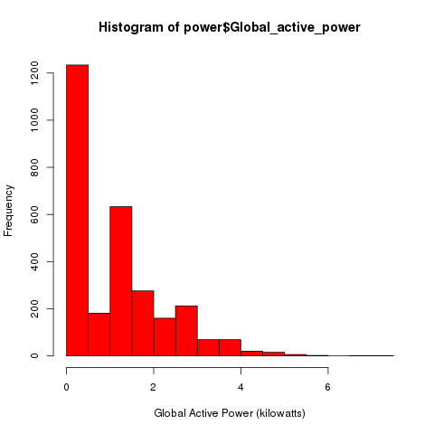
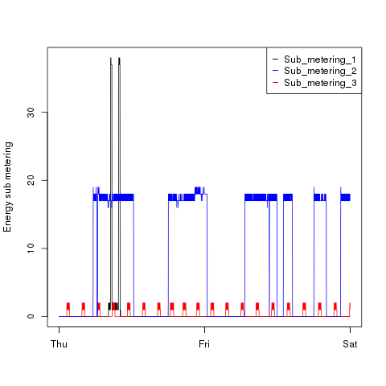
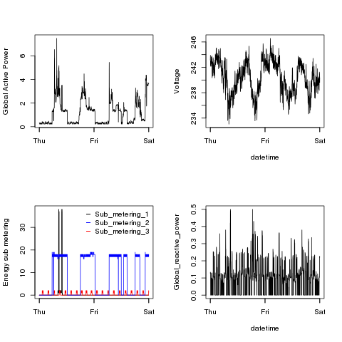

## Introduction
Assignment 1 for Exploratory Data Analysis.
The 4 plots below are generated by the associated .R files. 

This assignment uses data from
### Plot 1

  

### Plot 2

 

  

### Plot 3

 

  

### Plot 4

 

  

